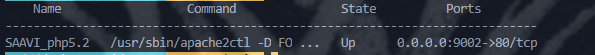

<p align="center"></p>

# Docker-Compose para generar un ambiente de desarrollo base de PHP5.2 APACHE Y SQL-SERVER

**NOTA:** Antes de modificar este archivo clone el repositorio de su proyecto y se sugiere que se coloque dentro de la ruta */var/www/html* .

**NOTA:** Este proyecto es para levantar proyectos Legacy de php5.2 con conexiones sql-server con el módulo de **mssql.**

## **Configuración Inicial**

Primero se tiene que tener instalado Docker y Docker-compose.

Después de clonar el proyecto y entrar a la carpeta del proyecto se debe realizar lo siguiente:

### **Opcional**

Un vez clonado este repositorio cambiarle el nombre de la carpeta para que sea facil de identificar.

### **Crear la carpeta Log**

Esta carpeta se debe crear en la raiz del proyecto de docker para posteriormente ver los logs del sistema ya en ejecución. Dentro de su editor crear la carpeta log. En la terminal ejecutar el siguiente comando.

```bash
$ mkdir log
```

### **Archivo docker-compose.yml**

Dentro del archivo docker-compose.yml editar las siguientes lineas:

`
  Linea 5: nombre del contenedor
`

`
container_name: nombre_proyecto_php5.2
`

<br>

`
  Linea 9: ruta del proyecto
`
<br>

**NOTA:** Si el proyecto se encuentra dentro de otra ubicación, colocar la ruta del proyecto antes de los dos puntos. La ruta despues de los dos puntos no se debe modificar. 

`
 -/var/www/html/nombre_proyecto:/var/www/html/nombre_proyecto
`

<br>

`
  Linea 18: puerto que se expone el sitio
`
<br>

**NOTA:**En el ejemplo el sitio sale por el puerto 9002, aqui coloque el puerto que va utilizar. El puerto 80 despues de los puntos no se modifica.

`
  -9002:80
`
<br>

Guardar archivo.

<br>


### **Archivo Dockerfile**

Dentro del archivo unicamente editar las siguiente linea:

`
  Linea 325: nombre del proyecto dentro del contenedor
`

`
WORKDIR /var/www/html/residentes
`

<br>


### **Archivo de confifuración Apache**

Entrar a la carpeta conf y con su editor de código o terminal editar el archivo en lo siguiente:

`
  Linea 2: dominio del sitio, aunque esta linea puede ser eliminada.
`

`
ServerName tudominio.org
`

<br>

`
  Linea 3 y 5: solo cambiar por el nombre del proyecto, no modificar la ruta.
`

`
DocumentRoot /var/www/html/nombre_proyecto
`

`
<Directory /var/www/html/nombre_proyecto>
`

guardar archivo.

<br>

### **Levantando los contenedores Docker**

Una vez terminado las adecuaciones en los archivos de configuración, en su terminal se debe ejcutarlos los siguientes comandos en la raiz del proyecto docker.

Ejecute el siguiente comando en la raiz del proyecto:

```bash
$ docker-compose up -d --build
```
Si el proyecto marca errores favor de volver a revisar los archivos que se modificaron de no ser así ejecute el siguiente comando para corrobar que se levantaron el contenedor:

```bash
$ docker-compose ps
```
Mostrara un listado similar a la siguiente imagen:
<p align="center"></p>

Por ultimo paso corroborar que el sitio este levantado.<br>

**NOTA:** Si el proyecto no se muestra, verificar los permisos del proyecto o la configuración que necesita.<br>

**NOTA:** Si requiere otros módulos que activar en el php o agregar más configuración en apache, debera consultar la documentación. 
El proyecto es unicamente para levantar sitios Legacy y debera probar cada funcionamiento del sistema.

**NOTA:** Se convirtio en volumen el archivo **php.ini** por si requiere de hacer un modifación en ella. Estos cambios debe generarlos cuando el contenedor este abajo.